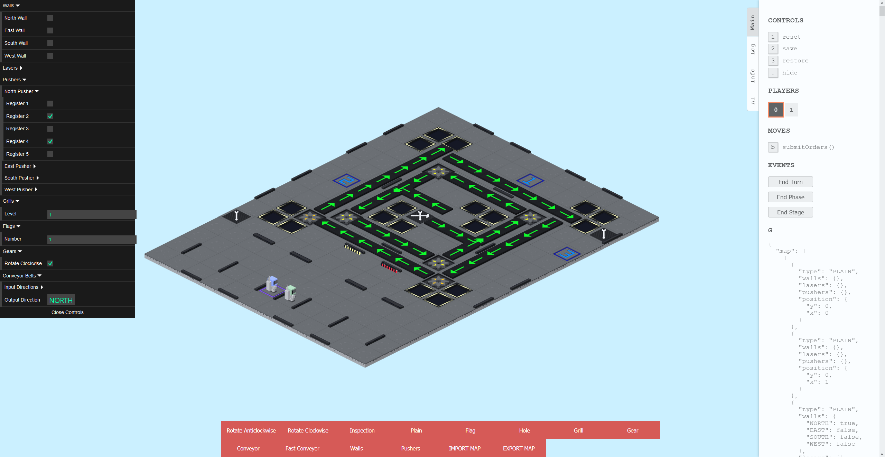
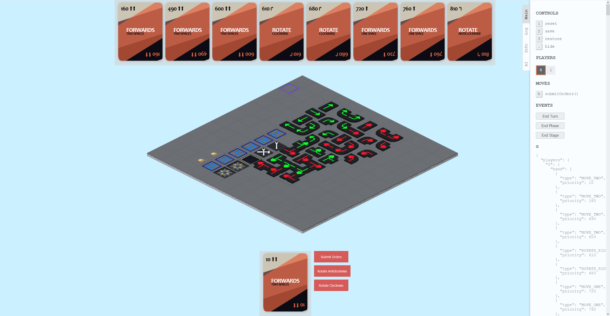

### Robot Fight

> The up and coming sequel to 'space fight'!  Continuing a long history of badly named games.

#### Current Version

The current version includes walls, pushers, different coloured robots and more!  Pictured below is the map editor, which has existed in previous versions but now includes lots more tile options and pusher configurations.

#### Historical Versions

This version added styled buttons, fixed card moving mechanics and styled them to be at the top and bottom of the screen.

V2 implemented 'plain' tiles, allowing the floor to not be so hazardous anymore.  As well as that, we added a host of new tiles including:

- Curved conveyors
- Repair stations
- Gears
- More checkpoints

Cards were also styled, albeit they were badly bugged.

V1 had only a few tiles, specifically 'hole', 'straight conveyors' and 'checkpoints'.  The limited tiling meant we styled the ground as 'holes' which you couldn't actually fall through.

